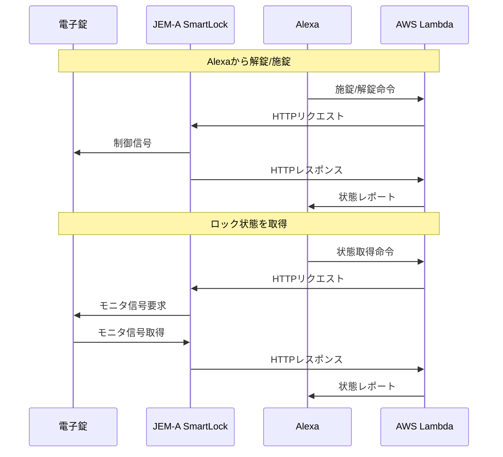

# alexa-skill-lambda-smartlock
Alexa Smart Home Skill Smart Lock

## 概要
[jema-smartlock](https://github.com/nana4rider/jema-smartlock)のRESTful APIと接続し、
Alexaの[ロックデバイス](https://developer.amazon.com/ja-JP/docs/alexa/smarthome/build-smart-home-skills-for-locks.html)として認識させるプログラムです。

## フロー



## DynamoDB
テーブル名`alexa_home_lock_devices`で下記データを作成
```json
{
  "id": {
    "S": "デバイスID(任意)"
  },
  "apiUrl": {
    "S": "jema-smartlockのRESTful APIのURL"
  },
  "apiKey": {
    "S": "jema-smartlockのRESTful APIのAPIキー"
  },
  "name": {
    "S": "デバイス名(任意)"
  }
}
```
